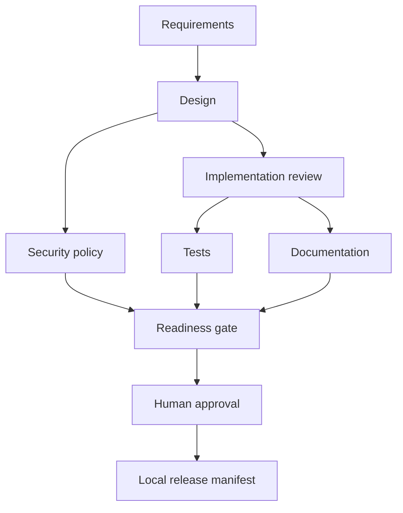

# Architecture and engineering decisions
.NET implementation: MVC controller → application service → data-provider interface
→ EF Core SQL Server provider. Controllers map HTTP and model-validation results;
services own URL policy and domain decisions; the provider owns persistent SQL Server
storage. A process-wide semaphore serializes writes for the single API process.
LocalDB is used for Windows development; production must provide a managed SQL Server
connection string. EF Core migrations version the schema and transient SQL failures
use bounded retries. No raw IP, user agent or
referrer is retained. URLs are never fetched, eliminating server-side
URL-fetch SSRF; public-looking DNS names can still resolve privately in the visitor's
browser. Destination abuse screening is deferred.

## Stateful orchestration

Each dependency is an entry gate; structured artifact validity is an exit gate.
Parallel siblings synchronize before readiness. Requirement revision resets the
transitive descendants and revokes approval; history remains in the audit chain.
Failed workers retry once, discard failed outputs, and safe-stop after exhaustion.
Fallback is manual correction and revision, never bypassing validation. A stop
allows already-running sibling workers to finish but schedules no subsequent wave.
Applied implementation files are restored from a persisted text snapshot after a
failed downstream stage or requirement revision; this is source restoration, not a
rollback of deployed infrastructure.

Atomic file replacement persists state. Workers receive a full immutable JSON
snapshot with revision, artifacts, decisions and audit lineage. An interrupted
stage is replayed; all workers must therefore be idempotent. One orchestrator process
per run file is required. No concurrent edits/approval while run() is executing.

Human oversight is a local CLI checkpoint with reviewer identity and revision; it
is not enterprise identity verification. Hash chaining detects modification when
verified against a trusted root; it is not tamper-proof storage. Production requires
signed external audit retention, RBAC, artifact-bound signatures and distributed leases.

Metrics report current stage success ratio, cumulative retries and rollback count,
mean recovered-stage time, and observed run latency (including approval wait).
These are prototype metrics, not fleet SLOs or a statistically valid availability claim.

## Three scenarios
| Scenario | Decomposition | Validation | Oversight |
|---|---|---|---|
| Greenfield | requirement → API design → isolated agent patch; security in parallel; tests/docs join | agent patch build plus workflow tests | inspect patch and approve manifest |
| Brownfield | requirement → baseline hashes/API contract → isolated agent patch | build and API regression gate | approve compatibility evidence |
| Ambiguous | record questions; approval blocked until revision → agent execution | revised requirement is carried into the agent request | owner confirms interpretation via revision before approval |

The default workers generate structured evidence without changing the checkout. When
configured, `CommandCodeAgent` gives an external model-backed agent a disposable copy,
collects its patch, and runs the build gate before preserving the artifact. It does not
apply changes or deploy automatically; human review remains the control point. See
`docs/AGENT_PROTOCOL.md` for the adapter boundary and remaining production controls.
